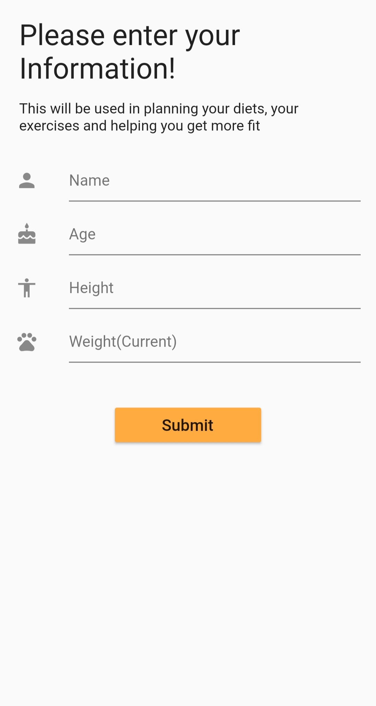
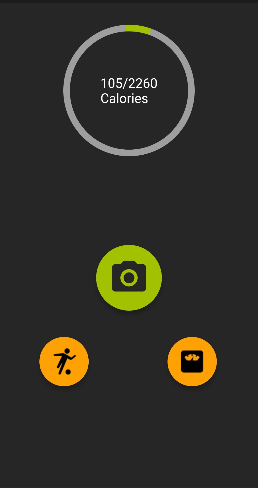
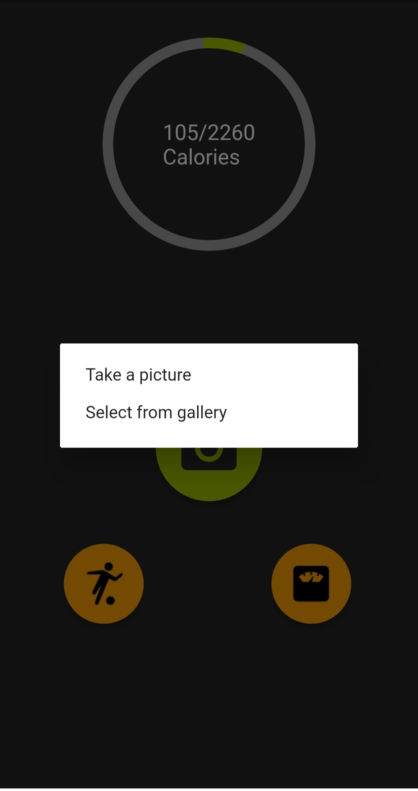
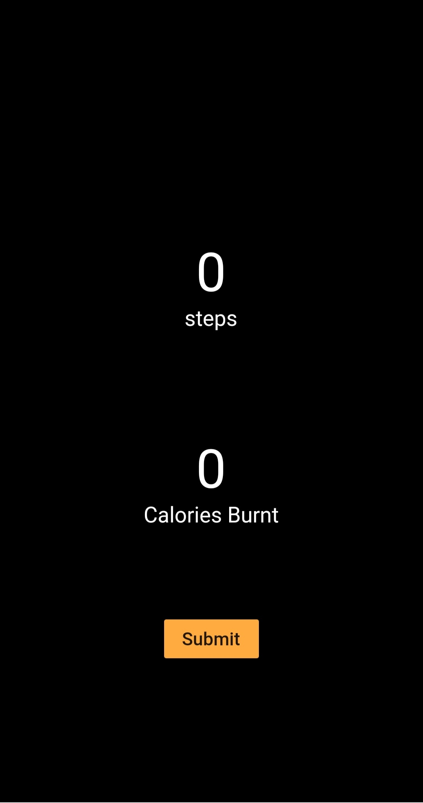

  

  

&nbsp;&nbsp;&nbsp;&nbsp;&nbsp;&nbsp;&nbsp;&nbsp;&nbsp;&nbsp;&nbsp;&nbsp;&nbsp;&nbsp;&nbsp;&nbsp;&nbsp;&nbsp;&nbsp;&nbsp;&nbsp;&nbsp;&nbsp;&nbsp;&nbsp;&nbsp;&nbsp;&nbsp;&nbsp;&nbsp;&nbsp;&nbsp;&nbsp;&nbsp;&nbsp;&nbsp;&nbsp;&nbsp;&nbsp;&nbsp;&nbsp;&nbsp;&nbsp;&nbsp;&nbsp;&nbsp;&nbsp;&nbsp;&nbsp;&nbsp;&nbsp;&nbsp;&nbsp;&nbsp;&nbsp;&nbsp;&nbsp;

An cross platform mobile application :iphone: developed in flutter to keep track of daily calorie needs. The calories required are calculated using BMI for which the inputs are taken from the user :bow: and stored in the database. The application is integrated with pedometer to keep count of number of steps taken by the user :walking: which helps to determine the calories burnt.

<ul>
  <li> The application uses <a href="https://cloud.google.com/vision/">Vision API</a> to determine the food item :pizza: from the picture which can be either taken from the phone camera or can be selected from the Gallery.

  <li> The JSON response recieved from the Vision API containing the name of the food item is cross referenced with the <a href="https://world.openfoodfacts.org/">openfoodfacts</a> database :page_facing_up: to get the nutritional facts.
  
  <li> For each 20 steps :paw_prints: counted by pedometer we deduct one calorie from the number of calories consumed by the user per day.
</ul>

# Screenshots

  
   
  
  

